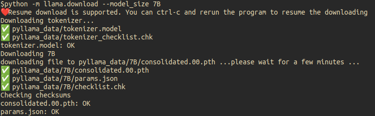

# 🦙 LLaMA - Run LLM in A Single 4GB GPU


> 📢 `pyllama` is a hacked version of `LLaMA` based on original Facebook's implementation but more convenient to run in a Single consumer grade GPU.

> The Hugging Face's LLaMA implementation is available at `pyllama.hf`.

## 📥 Installation

In a conda env with pytorch / cuda available, run
```
pip install pyllama -U
```

> 🐏 If you have installed llama library from other sources, please uninstall the previous llama library and use `pip install pyllama -U` to install the latest version.


## 📦 Download Model Files

### 🧘‍♀️ Official Way

In order to download the checkpoints and tokenizer, fill this [google form](https://forms.gle/jk851eBVbX1m5TAv5)

Once your request is approved, you will receive links to download the tokenizer and model files.
Edit the `download.sh` script with the signed url provided in the email to download the model weights and tokenizer.

### 🐒 Community Way

- 1. pyllama

There is another high-speed way to download the checkpoints and tokenizers. There are four models(7B,13B,30B,65B) available. To download all of them, run:

```bash
python -m llama.download
```

To download only the 7B model files to your current directory, run:

```bash
python -m llama.download --model_size 7B
```

To download only the 7B and 30B model files to folder `/tmp/pyllama_data`, run:

```bash
python -m llama.download --model_size 7B,30B --folder /tmp/pyllama_data
```

The help doc is:
```bash
$python -m llama.download --help
usage: download.py [-h] [--model_size MODEL_SIZE] [--folder FOLDER]

optional arguments:
  -h, --help            show this help message and exit
  --model_size MODEL_SIZE
                        The size of the models that you want to download. A comma separated
                        string of any of "7B", "13B", "30B", "65B". Totally 219G disk space
                        is needed to download them all. If you only want to download the 7B
                        model, just put "7B" here.
  --folder FOLDER       The target folder for the download files
```

- Sample Screenshot



- 2. Bittorrent

🔥 In order to download the checkpoints and tokenizer, use this BitTorrent link: "[magnet:?xt=urn:btih:ZXXDAUWYLRUXXBHUYEMS6Q5CE5WA3LVA&dn=LLaMA](magnet:?xt=urn:btih:ZXXDAUWYLRUXXBHUYEMS6Q5CE5WA3LVA&dn=LLaMA)".


## 💎 Quantize LLaMA to run in a 4GB GPU

`pyllama` support quantization of 2/3/4/8-bit so that you can run model in a 4G memory GPU.

> You need to run `export HUGGING_FACE_HUB_TOKEN=XXX` to be able to access Hugging Face's data. You also need to install [gptq](https://pypi.org/project/gptq/) with command `pip install gptq`.

```bash
python -m llama.llama_quant --help
usage: llama_quant.py [-h] [--ckpt_dir CKPT_DIR] [--tokenizer_path TOKENIZER_PATH] 
                      [--seed SEED] [--nsamples NSAMPLES] [--percdamp PERCDAMP]
                      [--nearest] [--wbits {2,3,4,8,16}] [--groupsize GROUPSIZE]
                      [--save SAVE] [--load LOAD] [--benchmark BENCHMARK] [--check]
                      [--cuda CUDA] [--eval]
                      {wikitext2,ptb,c4}

positional arguments:
  {wikitext2,ptb,c4}    Where to extract calibration data from.

optional arguments:
  -h, --help            show this help message and exit
  --ckpt_dir CKPT_DIR
  --tokenizer_path TOKENIZER_PATH
  --seed SEED           Seed for sampling the calibration data.
  --nsamples NSAMPLES   Number of calibration data samples.
  --percdamp PERCDAMP   Percent of the average Hessian diagonal to use for dampening.
  --nearest             Whether to run the RTN baseline.
  --wbits {2,3,4,8}  bits for quauntization
  --groupsize GROUPSIZE
                        Groupsize to use for quantization; default uses full row.
  --save SAVE           Save quantized checkpoint under this name, eg pyllama-7B4b.pt.
  --load LOAD           Load quantized model.
  --benchmark BENCHMARK
                        Number of tokens to use for benchmarking.
  --check               Whether to compute perplexity during benchmarking for verification.
  --cuda CUDA           GPU device string, 'cuda:0' by default.
  --eval                Evaluate the model with dataset wikitext2, ptb and c4
```

- Quantize 7B model to 8-bit

```bash
python -m llama.llama_quant decapoda-research/llama-7b-hf c4 --wbits 8 --save pyllama-7B8b.pt
```

- Quantize 7B model to 4-bit with groupsize 128 (the recommended setup 🔥)

```bash
python -m llama.llama_quant decapoda-research/llama-7b-hf c4 --wbits 4 --groupsize 128 --save pyllama-7B4b.pt
```

- Quantize 7B model to 2-bit

```bash
python -m llama.llama_quant decapoda-research/llama-7b-hf c4 --wbits 2 --save pyllama-7B2b.pt
```

The download links for quantized LLaMA files are below:

- 7B

| Quant Type   |      Size      |  Link | MD5 |Loss | Password |
|----------|:-------------:|------:|------:|------:|--:|
| 2-bit |  2160484475 | [🔗](https://pan.baidu.com/s/1zOdKOHnSCsz6TFix2NTFtg) | 4c7215d28c1f650218c43fc46402cec5|- | 8g9d |
| 3-bit |  - | - | -|- |-|
| 4-bit |  3779485819 | - | cce9a3b522ddf5c011ee0174b2ff3dfb|- |-|
| 8-bit |  7017493231 | - | 2648b09597cf8f9e0d1a04cb70b71cab|- |-|


It took me 2 hours 40 mins to quantize the 65B model to 4bit. The file size is reduced from 122GB to 32GB.

> The following suggestions are recommended for LLM qunatization:
> 1. By default, use 4-bit quantization for LLM inference as it offers the total model bits and zero-shot accuracy trade-offs.
> 2. Use a block size of 128 or lower to stabilize 4-bit quantization and improve zero-shot performance.
> 3. Use a floating point or quantile quantization data type. In some cases, integer data types might be preferable to improve inference latency depending on the implementation and hardware support.

## 🔮 Single GPU Inference

### 🥥 Without Quantization

Set the environment variables `CKPT_DIR` as your llamm model folder, for example `/llama_data/7B`, and `TOKENIZER_PATH` as your tokenizer's path, such as `/llama_data/tokenizer.model`.

And then run the following command:

```bash
python inference.py --ckpt_dir $CKPT_DIR --tokenizer_path $TOKENIZER_PATH
```

The following is an example of LLaMA running in a 8GB single GPU.


### 🥝 With Quantization

With quantization, you can run LLaMA with a 4GB memory GPU.

- pyllama can run 7B model with 6GB GPU memory.


- pyllama can run 7B model with 3.2GB GPU memory.


### 💡 Tips

- To load KV cache in CPU, run `export KV_CAHCHE_IN_GPU=0` in the shell.

- To profile CPU/GPU/Latency, run:

```bash
python inference_driver.py --ckpt_dir $CKPT_DIR --tokenizer_path $TOKENIZER_PATH
```

A sample result is like:


- Tune `max_seq_len` and `max_batch_size` to reduce memory consumption to be able to run in GPU. Refer to: [this post](https://github.com/juncongmoo/pyllama/issues/9)!

### 🍉 Start a gradio webui


```bash
$ cd apps/gradio
$ python webapp_single.py  --ckpt_dir $CKPT_DIR --tokenizer_path $TOKENIZER_PATH
```

You should see something like this in your browser:


### 🍓 Start a web server

The following command will start a flask web server:

```bash
$ cd apps/flask
$ python web_server_single.py  --ckpt_dir $CKPT_DIR --tokenizer_path $TOKENIZER_PATH
```

## 🍒 Multiple GPU Inference

### 🧘‍♀️ Official Way

To use the original META's model parallel, please set environment variable `PYLLAMA_META_MP` like:

```
export PYLLAMA_META_MP=1
```

With this environment variable set, you can `import llama` and the original META version's llama will be imported.

The provided `example.py` can be run on a single or multi-gpu node with `torchrun` and will output completions for two pre-defined prompts. Using `TARGET_FOLDER` as defined in `download.sh`:

```bash
torchrun --nproc_per_node MP example.py --ckpt_dir $TARGET_FOLDER/model_size \
  --tokenizer_path $TARGET_FOLDER/tokenizer.model
```

Different models require different MP values:

|  Model | MP |
|--------|----|
| 7B     | 1  |
| 13B    | 2  |
| 30B    | 4  |
| 65B    | 8  |

### 🐒 Community Way

There are two steps to run LLaMA in multi-GPU environment.

- Convert original LLaMA model

```bash
$python -m llama.convert_llama --help
usage: convert_llama.py [-h] [--ckpt_dir CKPT_DIR] [--tokenizer_path TOKENIZER_PATH]
                        [--model_size {7B,13B,30B,65B}] [--output_dir OUTPUT_DIR]
                        [--max_batch_size MAX_BATCH_SIZE] [--to {hf,fb}]

optional arguments:
  -h, --help            show this help message and exit
  --ckpt_dir CKPT_DIR
  --tokenizer_path TOKENIZER_PATH
  --model_size {7B,13B,30B,65B}
  --output_dir OUTPUT_DIR
                        Location to write HF model and tokenizer
  --max_batch_size MAX_BATCH_SIZE
  --to {hf,fb}
```

- Run with HF's accelerate with multiple GPUs

```bash
$python -m llama.llama_multigpu --help
usage: llama_multigpu.py [-h] [--state_dict_dir STATE_DICT_DIR] [--model_size {7B,13B,30B,65B}]

optional arguments:
  -h, --help            show this help message and exit
  --state_dict_dir STATE_DICT_DIR
  --model_size {7B,13B,30B,65B}
```


## 🔬 Model Fine Tuning

### With [Standford Alpaca](https://github.com/tatsu-lab/stanford_alpaca) Instruction-Following Dataset

- Tokenization
- Finetuning
- Efficient FT

## 🧬 LLaMA model structure

- Meta
- Hugging Face

```
https://github.com/facebookresearch/llama/blob/main/llama/model.py#LL127C27-L127C27
```

### Model Card

See [MODEL_CARD.md](https://github.com/juncongmoo/pyllama/blob/main/MODEL_CARD.md)

### License

See the [LICENSE](https://github.com/juncongmoo/pyllama/blob/main/LICENSE) file.
